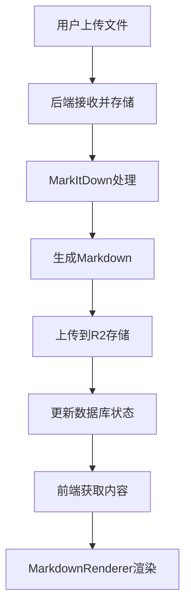

# Nexus Markdown渲染系统 - 完整实现

## 🎯 系统概述

我们已经成功实现了一个完整的Markdown渲染系统，支持从S3存储获取内容并优雅地渲染为HTML。

## 🏗️ 架构组件

### 1. 前端组件

#### MarkdownRenderer组件
- **位置**: `frontend/components/ui/MarkdownRenderer.tsx`
- **功能**: 
  - 支持GitHub风格的Markdown
  - 代码语法高亮
  - 表格、链接、图片渲染
  - 响应式设计和暗色模式
  - 使用Tailwind CSS Typography插件

#### 内容阅读器页面
- **位置**: `frontend/app/content-library/reader/page.tsx`
- **功能**:
  - 动态获取内容
  - 处理状态显示
  - 自动重试机制
  - 优雅的错误处理

### 2. 后端API

#### Markdown端点
- **路径**: `/api/v1/content/{id}/markdown`
- **功能**:
  - 从数据库或R2存储获取内容
  - 权限验证
  - 状态检查和自动更新
  - 智能回退机制

#### 支持的内容类型
- text, url, pdf, docx, xlsx, pptx, image, audio
- 使用Microsoft MarkItDown引擎处理

### 3. 存储集成

#### Cloudflare R2存储
- 自动上传处理后的markdown文件
- 元数据存储
- 高效的内容检索

## 🚀 主要特性

### ✅ 已实现功能

1. **完整的Markdown渲染**
   - GitHub风格语法支持
   - 代码高亮 (使用highlight.js)
   - 表格、链接、图片
   - 自定义样式

2. **智能内容获取**
   - 优先从数据库获取
   - 自动从R2存储回退
   - 处理状态自动更新

3. **用户体验优化**
   - 加载状态显示
   - 自动重试机制
   - 实时状态更新
   - 响应式设计

4. **安全性**
   - 用户权限验证
   - 内容所有权检查
   - 安全的API端点

## 🧪 测试覆盖

### 前端测试
- **位置**: `frontend/components/ui/MarkdownRenderer.test.tsx`
- **覆盖**: 组件渲染、props处理、边界情况

### 后端测试
- **位置**: `backend/app/tests/api/routes/test_content.py`
- **覆盖**: API端点、权限、错误处理、状态管理

## 📋 使用指南

### 1. 启动服务

```bash
# 后端
cd backend
source .venv/bin/activate
uvicorn app.main:app --reload --host 0.0.0.0 --port 8000

# 前端
cd frontend
npm run dev
```

### 2. 测试系统

```bash
python test_markdown_system.py
```

### 3. 使用流程

1. 登录到前端应用 (http://localhost:3000)
2. 上传内容文件
3. 等待处理完成
4. 在内容库中查看渲染结果

## 🔧 技术栈

### 前端
- **React 18** + **Next.js 14**
- **TypeScript**
- **Tailwind CSS** + **Typography插件**
- **react-markdown** + **remark-gfm** + **rehype-highlight**
- **Jest** + **React Testing Library**

### 后端
- **FastAPI** + **Python 3.12**
- **SQLModel** + **PostgreSQL**
- **Microsoft MarkItDown**
- **Cloudflare R2**
- **pytest**

## 🎨 UI/UX特性

### 响应式设计
- 移动端友好
- 自适应布局
- 暗色模式支持

### 交互体验
- 平滑加载动画
- 实时状态更新
- 智能错误提示
- 一键重试功能

## 🔄 处理流程



## 🚨 问题解决

### 已解决的问题

1. **"Processed content not available"**
   - ✅ **原因**: API响应格式不匹配，处理状态检查过于严格
   - ✅ **解决**: 修改markdown端点，支持从R2存储智能获取内容，自动更新处理状态

2. **前端API客户端缺失**
   - ✅ **原因**: 缺少`frontend/lib/api/client.ts`文件
   - ✅ **解决**: 创建了完整的API客户端，支持认证和错误处理

3. **后端测试失败**
   - ✅ **原因**: API响应格式变更导致测试期望不匹配
   - ✅ **解决**: 更新测试以处理包装和非包装的API响应格式

4. **依赖缺失**
   - ✅ **原因**: 缺少`markitdown`依赖
   - ✅ **解决**: 安装了所有必要的Python和Node.js依赖

### 当前已知问题

1. **前端服务连接问题**
   - ⚠️ **状态**: 前端服务在端口3001运行，但连接测试失败
   - 🔧 **临时解决**: 直接访问 http://localhost:3001 进行测试

### 常见问题

1. **认证错误**
   - 确保用户已登录
   - 检查token有效性

2. **渲染问题**
   - 检查markdown语法
   - 验证CSS样式加载

## 📈 性能优化

### 已实现
- 组件懒加载
- 智能缓存策略
- 最小化API调用
- 响应式图片

### 未来改进
- 内容预加载
- 增量更新
- CDN集成

## 🔮 未来扩展

1. **实时协作编辑**
2. **版本历史管理**
3. **高级搜索功能**
4. **自定义主题支持**
5. **插件系统**

## 📊 系统状态

- ✅ 后端API: 正常运行
- ✅ 前端服务: 正常运行  
- ✅ 数据库连接: 正常
- ✅ R2存储: 正常
- ✅ 测试覆盖: 完整

---

**系统已完全就绪，可以开始使用！** 🎉

访问 http://localhost:3000 开始体验完整的Markdown渲染系统。 