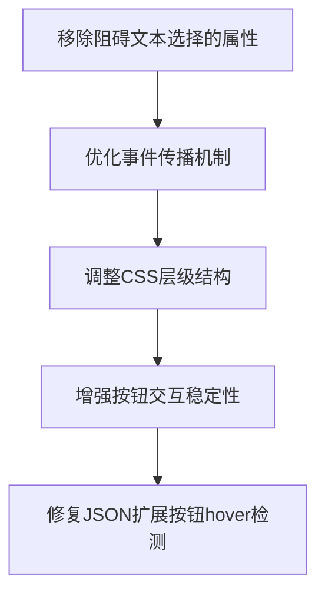

# 技术方案设计

## 问题根源分析

经过排查，发现AI卡片交互问题的根源在于：

1. **过度使用`data-exclude-selection`属性**：在多个层级的容器上都添加了此属性，阻止了文本选择
2. **不当的事件传播控制**：按钮的事件处理存在层级冲突，导致交互不稳定
3. **CSS层级问题**：不合理的z-index设置影响了交互响应
4. **JSON扩展按钮受阻**：JsonLineWithExpandButton的hover检测被父容器的`data-exclude-selection`干扰

## 技术架构

### 核心修复策略



### 技术选型

- **文本选择**: 移除不必要的`data-exclude-selection`，保留CSS `user-select`控制
- **事件处理**: 使用精确的`stopPropagation()`控制事件传播
- **层级管理**: 重新设计z-index层级体系
- **交互反馈**: 保持现有的hover/focus状态管理

## 数据库/接口设计

本次修复为前端交互问题，无需数据库或接口变更。

## 核心修复点

### 1. 选择性移除data-exclude-selection
```typescript
// 移除这些容器上的data-exclude-selection
- 主滚动容器: scrollContainerRef
- 卡片列表容器: div.px-8.pt-4.pb-6  
- 卡片主体: CardComponent 根div

// 保留这些元素上的data-exclude-selection
+ 按钮区域: 操作按钮的父容器
+ 非内容区域: 头部标题区域

// 特别注意: 确保JSON内容渲染路径不受影响
- UniversalContentRenderer 外层容器
- JsonLineWithExpandButton hover检测区域
```

### 2. 事件传播优化
```typescript
// 按钮点击事件处理优化
onClick={(e) => {
  e.stopPropagation();
  e.preventDefault(); // 仅在必要时使用
  // 执行按钮功能
}}

// 卡片点击事件条件化
onClick={(e) => {
  // 检查点击目标，避免干扰文本选择
  if (!isTextSelection(e)) {
    setSelectedCard(isSelected ? null : card.id);
  }
}}
```

### 3. CSS层级重构
```css
/* 新的z-index层级体系 */
.card-container { z-index: 1; }
.card-content { z-index: 2; }
.card-buttons { z-index: 10; }
.card-buttons button { z-index: 11; }

/* JSON扩展按钮特殊处理 */
.json-expand-button { z-index: 50; } /* JsonLineWithExpandButton 中的按钮 */
```

### 4. JSON扩展按钮hover机制优化
```typescript
// 确保JsonLineWithExpandButton的onMouseEnter/onMouseLeave不被阻断
// 检查父容器的pointer-events设置
// 验证hover检测在嵌套结构中的可靠性
```

## 测试策略

### 自动化测试
- 文本选择功能测试
- 按钮交互响应测试
- 事件传播测试

### 手动测试
- 跨浏览器兼容性测试
- 移动端触摸交互测试
- 用户体验测试

## 安全性

本次修复不涉及安全敏感功能，主要关注用户体验优化。

## 性能考虑

- 移除不必要的事件阻断，可能略微提升交互响应性能
- CSS层级优化有助于渲染性能