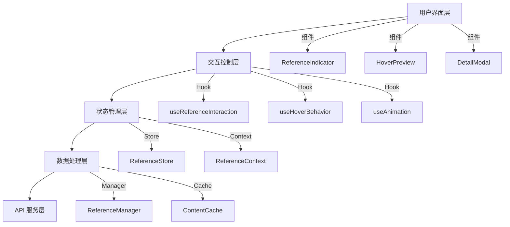

# 优雅引用交互系统技术方案设计

## 架构概览

### 系统分层



## 核心技术栈

- **UI 框架**: React 18 + TypeScript
- **动画库**: Framer Motion (基于现有)
- **状态管理**: Zustand + React Context
- **样式系统**: Tailwind CSS + CSS Variables
- **性能优化**: React.memo + useMemo + debounce

## 组件架构设计

### 1. 统一引用指示器 (UnifiedReferenceIndicator)

```typescript
interface UnifiedReferenceIndicatorProps {
  refId: number
  contentId: string
  variant?: 'minimal' | 'standard' | 'elegant'
  interactions?: {
    hover: boolean
    click: boolean
    keyboard: boolean
  }
}
```

**设计特性**：
- 18px 圆形设计，数字居中
- 三种视觉变体，默认 minimal
- 统一的悬浮和点击行为
- 内置无障碍支持

### 2. 智能悬浮预览 (SmartHoverPreview)

```typescript
interface SmartHoverPreviewProps {
  refId: number
  trigger: RefObject<HTMLElement>
  delay?: number
  position?: 'auto' | 'top' | 'bottom'
  maxWidth?: number
}
```

**设计特性**：
- 150ms 防抖延迟
- 智能位置计算，避免溢出
- 磨砂玻璃效果背景
- 弹性动画曲线

### 3. 详情模态面板 (DetailModal)

```typescript
interface DetailModalProps {
  refId: number
  isOpen: boolean
  onClose: () => void
  draggable?: boolean
  maxHeight?: string
}
```

**设计特性**：
- 居中显示，支持拖拽
- 可滚动内容区域
- ESC 键关闭
- 定位原文功能

## 状态管理设计

### ReferenceStore (Zustand)

```typescript
interface ReferenceState {
  // 悬浮状态
  hoveredRef: number | null
  hoverTimeout: NodeJS.Timeout | null
  
  // 详情面板状态
  activeModal: number | null
  modalPosition: { x: number; y: number }
  
  // 缓存数据
  contentCache: Map<string, ReferenceContent>
  previewCache: Map<string, PreviewData>
  
  // 交互配置
  config: {
    hoverDelay: number
    hideDelay: number
    animationDuration: number
    enableAnimations: boolean
  }
}
```

### 行为管理 Hooks

```typescript
// 悬浮行为控制
const useHoverBehavior = (refId: number, options: HoverOptions) => {
  // 防抖处理
  // 智能延迟
  // 多引用冲突处理
}

// 动画控制
const useReferenceAnimation = (type: 'hover' | 'modal' | 'indicator') => {
  // 统一动画配置
  // 性能优化
  // 设备适配
}

// 键盘导航
const useKeyboardNavigation = () => {
  // Tab 键导航
  // Enter 激活
  // ESC 关闭
}
```

## 动画系统设计

### 1. 动画配置

```typescript
const animationConfig = {
  hover: {
    duration: 0.2,
    ease: [0.25, 0.46, 0.45, 0.94], // easeOutQuart
    scale: { from: 0.95, to: 1 },
    opacity: { from: 0, to: 1 },
    y: { from: 8, to: 0 }
  },
  
  modal: {
    duration: 0.3,
    ease: [0.16, 1, 0.3, 1], // easeOutExpo
    scale: { from: 0.96, to: 1 },
    opacity: { from: 0, to: 1 },
    backdropBlur: { from: 0, to: 4 }
  },
  
  indicator: {
    duration: 0.15,
    ease: [0.4, 0, 0.2, 1], // easeInOut
    scale: { from: 1, to: 1.1 },
    shadow: { from: 2, to: 8 }
  }
}
```

### 2. 性能优化

- **GPU 加速**: 使用 transform 和 opacity
- **帧率控制**: 基于 requestAnimationFrame
- **内存管理**: 及时清理未使用的动画实例
- **设备适配**: 低端设备自动降级

## 数据处理设计

### 缓存策略

```typescript
class ReferenceContentCache {
  private cache = new Map<string, CacheEntry>()
  private previewCache = new Map<string, PreviewEntry>()
  
  // LRU 缓存清理
  private maxSize = 100
  private ttl = 5 * 60 * 1000 // 5分钟
  
  async getContent(refId: number, contentId: string): Promise<ReferenceContent> {
    // 缓存命中检查
    // 后台预加载
    // 智能预测
  }
}
```

### API 集成

```typescript
interface ReferenceAPI {
  getContent(refId: number, contentId: string): Promise<ReferenceContent>
  getPreview(refId: number, contentId: string): Promise<PreviewData>
  trackInteraction(refId: number, action: 'hover' | 'click'): void
}
```

## 响应式设计

### 断点策略

```css
/* 桌面端 - 悬浮 + 点击 */
@media (min-width: 768px) {
  .reference-indicator {
    cursor: pointer;
  }
  
  .hover-preview {
    display: block;
  }
}

/* 移动端 - 轻触 + 长按 */
@media (max-width: 767px) {
  .reference-indicator {
    touch-action: manipulation;
  }
  
  .hover-preview {
    display: none;
  }
}
```

### 交互适配

- **桌面端**: 悬浮预览 + 点击详情
- **平板端**: 轻触预览 + 双击详情  
- **手机端**: 长按预览 + 轻触详情

## 无障碍设计

### 语义化标记

```tsx
<button
  ref={indicatorRef}
  className="reference-indicator"
  aria-label={`引用第${refId}段内容`}
  aria-describedby={`preview-${refId}`}
  aria-expanded={isHovered}
  onKeyDown={handleKeyDown}
  onClick={handleClick}
>
  {refId}
</button>

<div
  id={`preview-${refId}`}
  role="tooltip"
  aria-live="polite"
  className="reference-preview"
>
  {previewContent}
</div>
```

### 键盘导航

- **Tab**: 聚焦到引用指示器
- **Enter/Space**: 打开详情面板
- **Escape**: 关闭面板
- **Arrow Keys**: 在多个引用间导航

## 测试策略

### 单元测试
- Hook 逻辑测试
- 动画状态测试
- 缓存机制测试

### 集成测试
- 组件交互测试
- 响应式行为测试
- 无障碍功能测试

### 性能测试
- 动画帧率监控
- 内存泄漏检测
- 大量引用性能测试

### 用户测试
- A/B 测试不同延迟时间
- 用户行为数据收集
- 可用性测试反馈

## 安全性考虑

### XSS 防护
- 引用内容 HTML 清理
- CSP 策略配置
- 输入验证和转义

### 性能安全
- 防抖防止恶意触发
- 缓存大小限制
- API 调用频率限制

## 部署和监控

### 渐进式部署
1. 开发环境完整测试
2. 灰度发布 10% 用户
3. 监控性能和错误率
4. 全量发布

### 监控指标
- 引用交互成功率
- 平均悬浮延迟时间
- 动画性能指标
- 用户满意度评分

这个技术方案提供了一个统一、优雅、高性能的引用交互系统，能够满足所有需求并提供出色的用户体验。