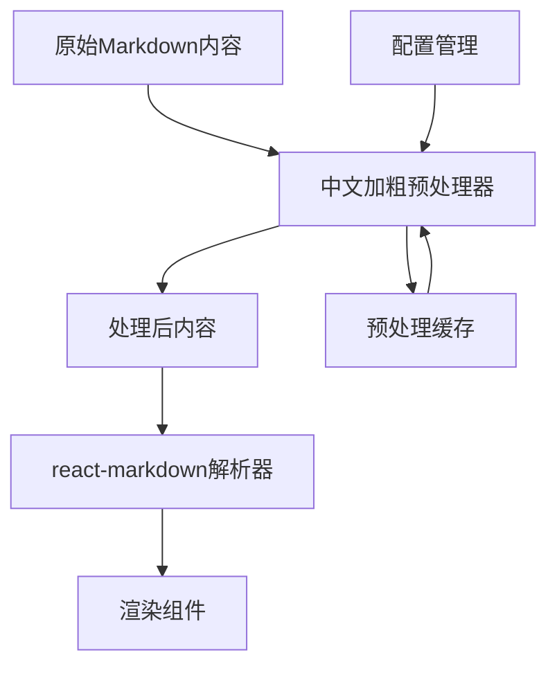

# 技术设计文档

## 架构概述

本方案采用"预处理+缓存"的架构模式，在Markdown内容传入解析器前进行中文加粗语法的标准化处理，确保react-markdown能够正确识别边界并渲染加粗效果。



## 技术栈

### 核心依赖
- **解析引擎**: react-markdown v10.1.0
- **语法扩展**: remark-gfm v4.0.1, remark-breaks v4.0.0
- **语法高亮**: rehype-highlight v7.0.2
- **数学公式**: rehype-katex v7.0.1

### 新增组件
- **预处理器**: 基于正则表达式的中文边界检测
- **缓存层**: React.useMemo + LRU缓存策略
- **配置系统**: 环境变量 + 运行时开关

## 技术选型

### 方案对比

| 方案 | 优势 | 劣势 | 实施复杂度 |
|------|------|------|------------|
| **预处理方案** (推荐) | 简单可靠、性能好、兼容性强 | 轻微改变原文 | 低 |
| 自定义remark插件 | 不改变原文、更精确 | 复杂度高、维护成本大 | 高 |
| 升级依赖库 | 官方支持、长期稳定 | 不确定能解决、可能引入新问题 | 中 |
| 替换解析器 | 可能根本解决问题 | 迁移成本巨大、兼容性风险 | 极高 |

### 选择理由
采用**预处理方案**，因为：
1. **快速可验证**: 可立即测试效果
2. **风险可控**: 不涉及核心库更改
3. **性能优良**: 缓存机制减少重复处理
4. **兼容性好**: 不破坏现有功能

## 接口设计

### 预处理器接口

```typescript
interface ChineseBoldPreprocessor {
  // 主处理函数
  process(content: string, options?: ProcessOptions): string;
  
  // 缓存管理
  clearCache(): void;
  getCacheStats(): CacheStats;
}

interface ProcessOptions {
  enabled: boolean;           // 是否启用处理
  preserveSpaces: boolean;    // 是否保留原有空格
  cacheSize: number;         // 缓存大小限制
}

interface CacheStats {
  hitRate: number;
  totalRequests: number;
  cacheSize: number;
}
```

### 配置接口

```typescript
interface MarkdownConfig {
  chineseBoldFix: {
    enabled: boolean;
    debugMode: boolean;
    cacheSize: number;
    preserveOriginalSpaces: boolean;
  };
}
```

## 数据库设计

本方案不涉及数据库schema变更，所有处理都在前端进行。数据库中存储的原始Markdown内容保持不变，确保数据完整性。

## 核心算法

### 中文边界检测算法

```typescript
const chineseBoldRegex = /([\u4e00-\u9fff\u3000-\u303f\uff00-\uffef])(\*\*[^*]+\*\*)([\u4e00-\u9fff\u3000-\u303f\uff00-\uffef])/g;

function preprocessChineseBold(content: string): string {
  return content
    // 中文字符与**之间插入空格
    .replace(/([\u4e00-\u9fff\u3000-\u303f\uff00-\uffef])(\*\*)/g, '$1 $2')
    // **与中文字符之间插入空格  
    .replace(/(\*\*)([\u4e00-\u9fff\u3000-\u303f\uff00-\uffef])/g, '$1 $2');
}
```

### 缓存策略

```typescript
class LRUCache<K, V> {
  private maxSize: number;
  private cache = new Map<K, V>();
  
  constructor(maxSize: number = 100) {
    this.maxSize = maxSize;
  }
  
  get(key: K): V | undefined {
    const value = this.cache.get(key);
    if (value !== undefined) {
      // LRU: 移到最后
      this.cache.delete(key);
      this.cache.set(key, value);
    }
    return value;
  }
  
  set(key: K, value: V): void {
    if (this.cache.has(key)) {
      this.cache.delete(key);
    } else if (this.cache.size >= this.maxSize) {
      // 删除最久未使用的项
      const firstKey = this.cache.keys().next().value;
      this.cache.delete(firstKey);
    }
    this.cache.set(key, value);
  }
}
```

## 测试策略

### 单元测试
- **边界检测测试**: 各种中文标点符号组合
- **性能测试**: 大文本处理性能
- **缓存测试**: LRU缓存逻辑验证

### 集成测试  
- **组件测试**: MarkdownRenderer集成测试
- **样式测试**: notebook/defaultStyle/headspace渲染测试
- **兼容性测试**: 英文内容不受影响

### E2E测试
- **JsonL渲染测试**: 完整的内容渲染流程
- **性能回归测试**: 页面加载时间对比

### 测试用例

```typescript
describe('Chinese Bold Preprocessing', () => {
  test('中文标点紧贴加粗', () => {
    expect(process('中文，**加粗**。')).toBe('中文， **加粗** 。');
  });
  
  test('保持英文不变', () => {
    expect(process('English **bold** text')).toBe('English **bold** text');
  });
  
  test('混合中英文', () => {
    expect(process('中文**bold**英文')).toBe('中文 **bold** 英文');
  });
});
```

## 安全性

### 输入验证
- **内容长度限制**: 防止DoS攻击
- **正则表达式安全**: 避免ReDoS漏洞
- **缓存大小限制**: 防止内存泄漏

### 数据保护
- **原文保护**: 不修改数据库中的原始内容
- **可逆性**: 确保处理结果可以回退
- **隔离性**: 预处理不影响其他Markdown功能

## 性能优化

### 缓存策略
- **LRU缓存**: 避免重复处理相同内容
- **缓存大小**: 默认100条，可配置
- **缓存键**: 基于内容hash生成

### 处理优化
- **延迟处理**: 使用React.useMemo避免不必要的重新处理
- **正则优化**: 使用编译后的正则表达式
- **批量处理**: 对大文档进行分块处理

### 监控指标
- **缓存命中率**: 目标>80%
- **处理时间**: 单次处理<1ms
- **内存使用**: 缓存占用<1MB

## 部署策略

### 分阶段发布
1. **阶段1**: 默认关闭，内部测试
2. **阶段2**: 小范围用户测试  
3. **阶段3**: 全量发布，默认开启

### 配置管理
```env
# 环境变量配置
MARKDOWN_CHINESE_BOLD_FIX_ENABLED=true
MARKDOWN_CHINESE_BOLD_CACHE_SIZE=100
MARKDOWN_CHINESE_BOLD_DEBUG=false
```

### 回滚方案
- **即时回滚**: 通过环境变量关闭功能
- **代码回滚**: Git回退到修复前版本
- **灰度控制**: 按用户ID进行开关控制