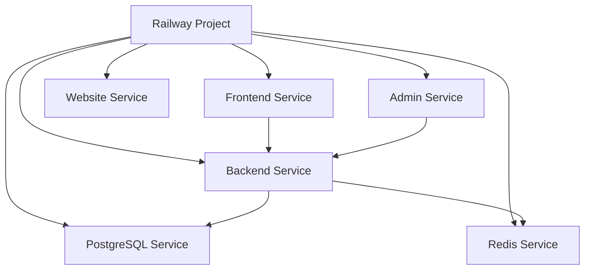

# Railway 部署技术方案设计

## 架构概述

基于 Railway 平台的特性和项目的多服务架构，采用 **多服务独立部署** 的策略，每个主要服务作为独立的 Railway 服务进行部署，通过环境变量和服务发现实现服务间通信。

## 技术栈分析

- **Backend**: Python FastAPI + PostgreSQL + Redis
- **Frontend**: Next.js (Static Site Generation)  
- **Admin**: Vite (Static Site Generation)
- **Database**: Railway PostgreSQL 服务
- **Cache**: Railway Redis 服务
- **AI Proxy**: LiteLLM (集成到 Backend 或独立服务)

## 部署架构设计

### 服务拆分策略



### 服务配置设计

#### 1. Backend Service (Python FastAPI)
- **构建器**: Dockerfile
- **端口**: 8000
- **健康检查**: `/api/v1/utils/health-check/`
- **预部署命令**: 数据库迁移 (`alembic upgrade head`)
- **依赖**: PostgreSQL, Redis

#### 2. Frontend Service (Next.js)
- **构建器**: Nixpacks (Node.js)
- **构建命令**: `npm run build`
- **启动命令**: `npm run start`
- **端口**: 3000
- **依赖**: Backend API

#### 3. Admin Service (Vite)
- **构建器**: Nixpacks (Node.js)
- **构建命令**: `npm run build`
- **启动命令**: `npm run preview`
- **端口**: 5173
- **依赖**: Backend API

#### 4. Website Service (Next.js)
- **构建器**: Nixpacks (Node.js)
- **构建命令**: `npm run build`
- **启动命令**: `npm run start`
- **端口**: 3000

## 数据库设计

### PostgreSQL 配置
- 使用 Railway 托管的 PostgreSQL 服务
- 版本: PostgreSQL 17
- 连接池配置
- 备份策略: Railway 自动备份

### Redis 配置  
- 使用 Railway 托管的 Redis 服务
- 用于缓存和会话存储
- TTL 配置: 86400 秒 (24小时)

## 环境变量管理

### 通用环境变量
```
ENVIRONMENT=production
DOMAIN=${{ RAILWAY_PUBLIC_DOMAIN }}
```

### Backend 环境变量
```
DATABASE_URL=${{ PostgreSQL.DATABASE_URL }}
REDIS_URL=${{ Redis.REDIS_URL }}
SECRET_KEY=${{ SECRET_KEY }}
BACKEND_CORS_ORIGINS=["https://${{ Frontend.RAILWAY_PUBLIC_DOMAIN }}", "https://${{ Admin.RAILWAY_PUBLIC_DOMAIN }}"]
```

### Frontend 环境变量
```
NEXT_PUBLIC_API_URL=https://${{ Backend.RAILWAY_PUBLIC_DOMAIN }}
```

## 配置文件结构

### railway.toml 位置策略
```
/
├── railway.toml (根项目配置)
├── backend/
│   └── railway.toml (Backend 服务配置)
├── frontend/
│   └── railway.toml (Frontend 服务配置)  
├── admin/
│   └── railway.toml (Admin 服务配置)
└── website/
    └── railway.toml (Website 服务配置)
```

## 构建和部署流程

### 1. 构建阶段
- **Backend**: 使用 Dockerfile，包含 uv 包管理器优化
- **Frontend/Admin/Website**: 使用 Nixpacks 自动检测 Node.js 项目
- **静态资源**: 构建时生成，运行时提供

### 2. 部署阶段
- **数据库迁移**: Backend 部署前自动执行
- **服务启动**: 按依赖关系顺序启动
- **健康检查**: 所有服务配置健康检查端点

## 网络和安全配置

### CORS 配置
- Backend 允许 Frontend 和 Admin 域名访问
- 动态配置基于 Railway 提供的域名

### HTTPS 配置
- Railway 自动提供 HTTPS 证书
- 强制 HTTPS 重定向

## 监控和日志

### 健康检查配置
- **Backend**: `/api/v1/utils/health-check/` (GET)
- **Frontend**: `/api/health` 或根路径检查
- **检查间隔**: 30秒
- **超时**: 10秒

### 日志管理
- 使用 Railway 内置日志系统
- 结构化日志输出 (JSON 格式)
- 错误追踪集成 (Sentry)

## 扩展性考虑

### 水平扩展
- Backend: 支持多实例部署
- Frontend/Admin: 静态资源，天然支持 CDN
- Database: Railway 托管服务自动优化

### 性能优化
- **Backend**: FastAPI 异步特性 + 连接池
- **Frontend**: Next.js SSG + 图片优化
- **缓存**: Redis 缓存热点数据

## 成本优化

### 资源分配建议
- **Backend**: 1GB RAM, 1 vCPU (可扩展)
- **Frontend**: 512MB RAM, 0.5 vCPU  
- **Admin**: 512MB RAM, 0.5 vCPU
- **Database**: 按需配置，建议 2GB RAM
- **Redis**: 256MB RAM

## 安全性设计

### 密钥管理
- 使用 Railway 环境变量存储敏感信息
- JWT 密钥使用强随机生成
- 数据库连接使用 SSL

### API 安全
- CORS 严格配置
- 请求频率限制
- 输入验证和清理

## 测试策略

### 部署测试
- 预生产环境测试
- 数据库迁移测试
- API 集成测试
- 前端构建测试

### 监控测试
- 健康检查验证
- 性能基准测试
- 故障恢复测试