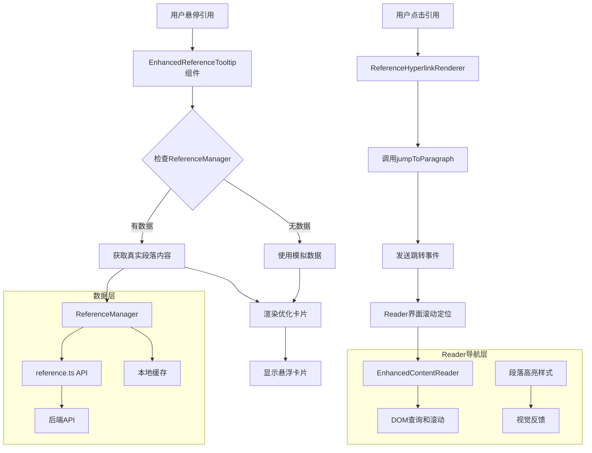
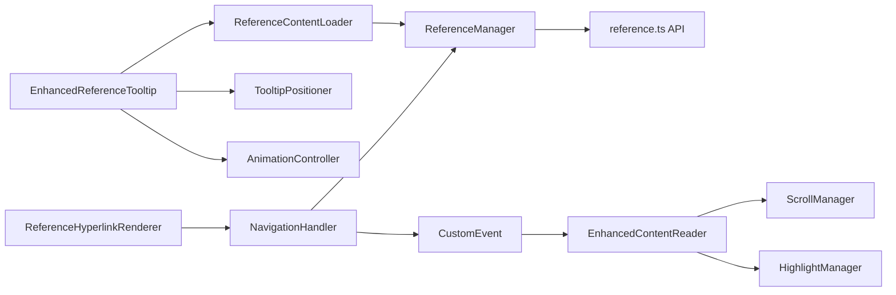
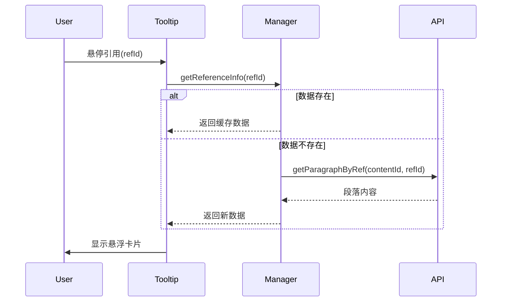
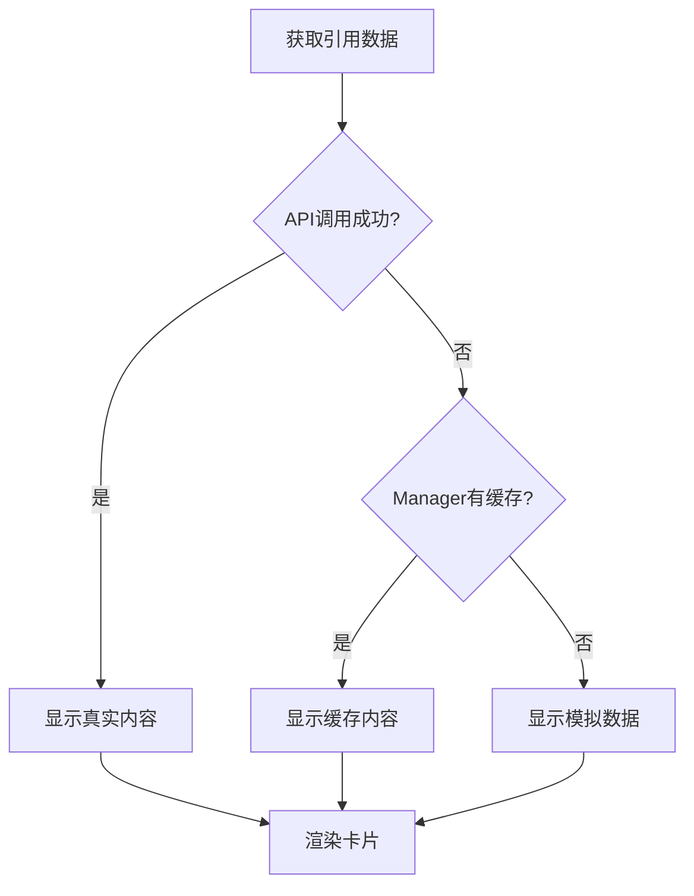

# 技术方案设计 - Ref引用悬浮卡片优化

## 技术架构

### 整体架构


## 技术栈和选型

### 前端技术栈
- **React + TypeScript**: 现有技术栈，保持一致性
- **ReferenceManager**: 现有的引用管理器，提供数据获取接口
- **reference.ts API**: 现有的API层，提供段落内容获取
- **Tailwind CSS**: 现有样式方案，保持UI一致性

### 组件架构


## 核心设计模式

### 1. 数据获取策略
- **优先级**: ReferenceManager → reference.ts API → 模拟数据
- **缓存机制**: 利用ReferenceManager的现有缓存
- **错误降级**: API失败时自动降级到模拟数据

### 2. 性能优化策略
- **防抖处理**: 500ms延迟避免频繁触发
- **内容截断**: 超过200字符显示省略号
- **延迟加载**: 只在悬停时才获取数据
- **内存优化**: 组件卸载时清理定时器

### 3. 用户体验优化
- **智能定位**: 自适应视口边界调整位置
- **渐进增强**: 从基础信息到详细内容逐步显示
- **平滑动画**: opacity和transform的组合动画
- **智能导航**: 一键跳转到原文位置，带视觉反馈
- **平滑滚动**: 使用smooth scrolling和居中显示
- **高亮反馈**: 目标段落高亮显示3-5秒

## 数据流设计

### 数据获取流程


### 错误处理流程


## 接口设计

### 增强的ReferenceInfo接口
```typescript
interface EnhancedReferenceInfo {
  refId: number;
  paragraphId: string;
  content: string;           // 主要内容
  title?: string;           // 章节标题
  snippet: string;          // 内容摘要
  position?: {             // 位置信息
    chapter: string;
    section: string;
    index: number;
  };
  context?: {              // 上下文信息
    before?: string;
    after?: string;
  };
  metadata?: {
    wordCount: number;
    lastUpdated: Date;
  };
}
```

### 组件Props设计
```typescript
interface OptimizedReferenceTooltipProps {
  refId: number;
  contentId?: string;       // 内容ID，用于API调用
  children: React.ReactElement;
  showPreview?: boolean;
  showContext?: boolean;    // 是否显示上下文
  maxLength?: number;       // 内容最大长度
  delay?: number;
  position?: 'auto' | 'top' | 'bottom' | 'left' | 'right';
  onReferenceLoad?: (info: EnhancedReferenceInfo) => void;
  onError?: (error: Error) => void;
}
```

## 实现细节

### 1. 数据获取优化
```typescript
const fetchReferenceContent = useCallback(async (refId: number) => {
  try {
    // 1. 优先从ReferenceManager获取
    const cachedInfo = actions?.getReferenceInfo?.(refId);
    if (cachedInfo?.content) {
      setContent(cachedInfo);
      return;
    }
    
    // 2. 从API获取详细信息
    if (contentId) {
      const paragraph = await referenceApi.getParagraphByRef(contentId, refId);
      if (paragraph) {
        setContent(enhanceReferenceInfo(paragraph, refId));
        return;
      }
    }
    
    // 3. 降级到增强的模拟数据
    setContent(generateEnhancedMockContent(refId));
  } catch (error) {
    console.error('Failed to fetch reference:', error);
    setContent(generateErrorContent(refId));
  }
}, [refId, contentId, actions]);
```

### 2. 位置计算优化
```typescript
const calculateOptimalPosition = useCallback(() => {
  if (!triggerRef.current || !tooltipRef.current) return;
  
  const trigger = triggerRef.current.getBoundingClientRect();
  const tooltip = tooltipRef.current.getBoundingClientRect();
  const viewport = { width: window.innerWidth, height: window.innerHeight };
  
  // 智能位置算法
  const positions = [
    { type: 'top', available: trigger.top >= tooltip.height + 10 },
    { type: 'bottom', available: trigger.bottom + tooltip.height + 10 <= viewport.height },
    { type: 'left', available: trigger.left >= tooltip.width + 10 },
    { type: 'right', available: trigger.right + tooltip.width + 10 <= viewport.width }
  ];
  
  const bestPosition = positions.find(pos => pos.available) || positions[0];
  setPosition(bestPosition.type);
}, []);
```

### 3. 内容渲染优化
```typescript
const renderTooltipContent = () => (
  <Card className="w-80 max-w-md shadow-xl border-2 bg-white dark:bg-gray-900">
    <CardContent className="p-4 space-y-3">
      {/* 头部信息 */}
      <TooltipHeader refId={refId} title={content?.title} position={content?.position} />
      
      {/* 主要内容 */}
      <TooltipContent 
        content={content?.content} 
        snippet={content?.snippet}
        maxLength={maxLength}
        loading={loading}
      />
      
      {/* 上下文信息 */}
      {showContext && content?.context && (
        <TooltipContext context={content.context} />
      )}
      
      {/* 操作按钮 */}
      <TooltipActions 
        onJump={() => actions?.jumpToParagraph?.(refId)}
        onClose={() => setIsVisible(false)}
      />
    </CardContent>
  </Card>
);
```

## 测试策略

### 单元测试
- ReferenceInfo数据获取逻辑
- 位置计算算法
- 错误处理机制
- 动画状态管理

### 集成测试
- 与ReferenceManager的集成
- API调用和错误处理
- 组件交互流程

### E2E测试
- 用户悬停交互
- 多种引用格式处理
- 响应式布局适配

## 安全性考虑

### 数据安全
- XSS防护：所有用户内容进行HTML转义
- 内容长度限制：防止超长内容影响性能
- API调用验证：确保contentId和refId的合法性

### 性能安全
- 防抖机制：避免恶意频繁触发
- 内存泄漏防护：及时清理定时器和事件监听
- 降级策略：API异常时的优雅降级

## 兼容性保障

### 向后兼容
- 保持现有EnhancedReferenceTooltip的API不变
- 渐进增强策略，不影响现有功能
- 可配置的功能开关

### 浏览器兼容
- 支持主流现代浏览器
- CSS Grid和Flexbox降级方案
- 动画效果的降级处理